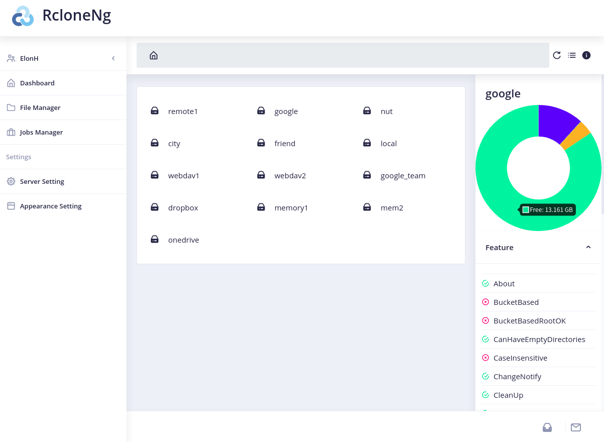
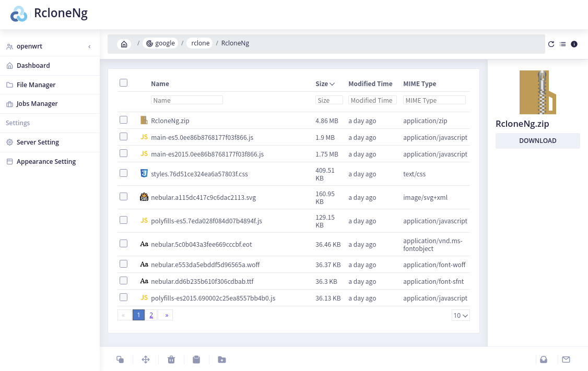
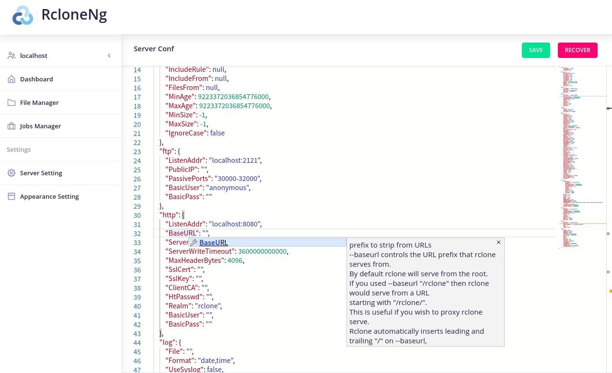
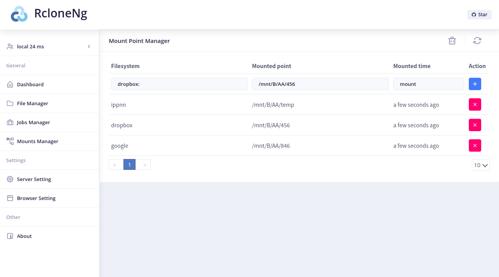
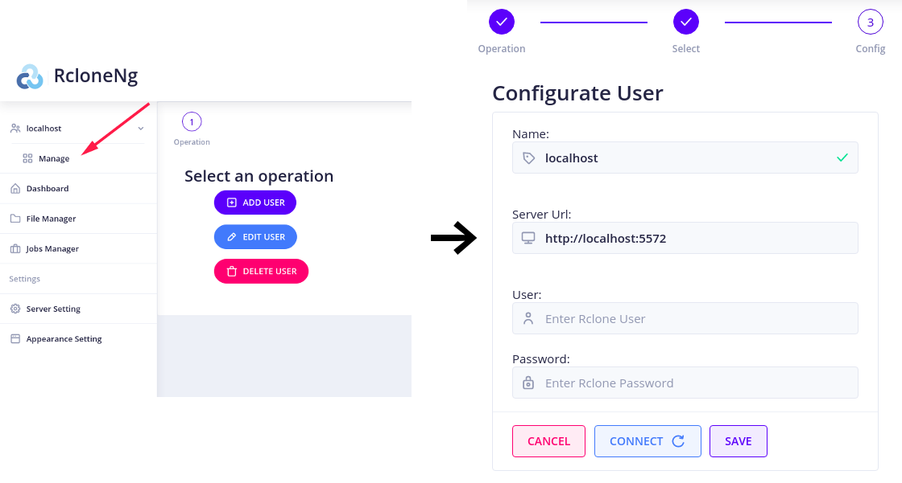

# RcloneNg


[](https://gitpod.io/#https://github.com/ElonH/RcloneNg)
[](https://david-dm.org/elonh/RcloneNG)

An angular web application for rclone

## Features

- Support multiple rclone server

- Explore remote file system

- Create asynchronous jobs of coping/moving objects between remotes

- Download file from remote

- Observe the progress of running jobs (by groups)

- Allow editing of rclone server configuration (power by [monaco editor](https://github.com/microsoft/monaco-editor), supporting lint, document description)

- Manager Rclone mounts

## Screenshots












## Get Started

1. running rclone as server

```bash
rclone rcd --rc-user=<user> --rc-pass=<password> --rc-allow-origin="http://localhost:4200"
```

2. getting RcloneNg

   - local way

     ```bash
     git clone https://github.com/ElonH/RcloneNg.git
     cd RcloneNg
     npm install # NodeJs version >= 10
     npm run start
     ```

   - online way

     [](https://gitpod.io/#https://github.com/ElonH/RcloneNg)

   - lazy way

     if set `--rc-allow-origin="https://elonh.github.io"`, <https://elonh.github.io/RcloneNg> can be used directly.ç
	 - Docker way
	   ```bash
	   docker run --name rcloneng -d -p 8080:80 elonh/rcloneng
		 ```

3. editing server connection in RcloneNg.



## License

This project and its dependencies ( except Rxjs, Apache-2.0 ) follows MIT license.
